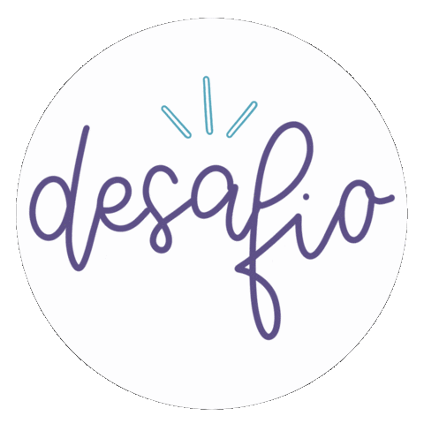

# Desafio-amigo-secreto

<div align="center">
  
</div>


## 📋 Sobre o Projeto

```

  Descrição: Desafio do amigo secreto da professora Genesys Rondon
  Autor: Julia Araujo
  


```


---

## 🚀 Como Executar o Projeto:


---


```

Clique abaixo para redirecionar:

```

[Amigo secreto](https://lordnecoreal.github.io/Desafio-amigo-secreto-concluido/)

---

## 👨‍🏫 Tutorial:

```

No gif abaixo estará ensinando todo o passo a passo para utilizar o site.

```
<div align="center">
  
</div>


---

## 📱Expansão no mobile:

```
Para quem está usando celular e a tela ficar curta, abaixo está a solução:

```


<div align="center">
  
</div>

---


## 🦸‍♀️Autor:

⭐️ Feito por [Julia](https://github.com/juharaujo19)

---

## 🛠️ Programas e sites Utilizado:

---

```
Visual Studio Code(VSC) 
bolt.new
Screen to gif

```
